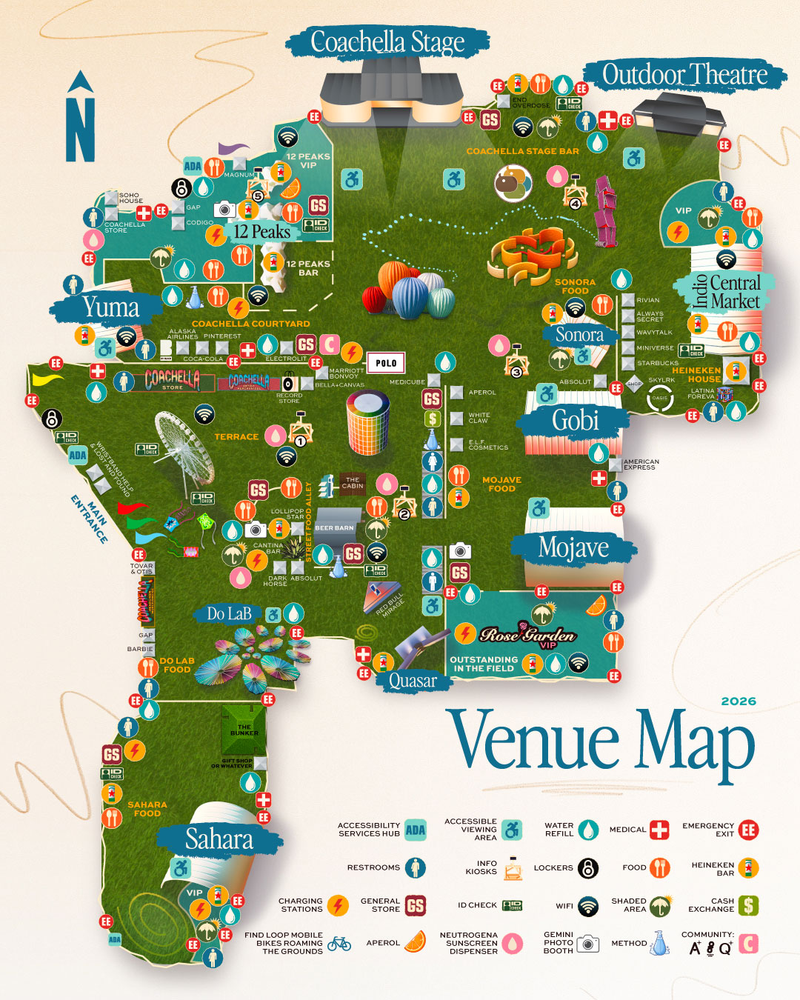

# Coachella 2026 Weekend 2 — Interactive Schedule Website

## Claude Code Implementation Plan

> **Target**: A single-page React app (`.html` or `.jsx`) deployed to GitHub Pages. Beautiful, functional, not "AI-looking." Think: editorial magazine meets festival culture. Warm desert tones, real typography, no gradient-card-with-drop-shadow generic vibes.

---

## 1. PROJECT OVERVIEW

**What we're building**: An interactive Coachella Weekend 2 (April 17–19, 2026) schedule planner that lets users browse performers by day/genre/time, build a personal plan, see conflicts, explore an interactive stage map, listen to artists on Spotify, view setlists, check shuttle times, and export their plan to PDF/PNG.

**Tech stack**: Single-file React (JSX artifact) with Tailwind utility classes, html2canvas + jsPDF for export. No build system needed — runs as a Claude artifact or standalone HTML on GitHub Pages.

**Dates**: Friday April 17 · Saturday April 18 · Sunday April 19 (no Monday — the festival is Fri–Sun only)

---

## 2. COMPLETE PERFORMER DATA

> Weekend 2 uses the **same set times** as Weekend 1. The schedule below is confirmed from the official Coachella release and TimeOut's full breakdown. All times are PDT.

### FRIDAY, APRIL 17

#### Coachella Stage
| Artist | Time | Genre | Spotify ID |
|--------|------|-------|------------|
| Record Safari | 4:15–5:20 PM | DJ / Vinyl | — |
| Teddy Swims | 5:30–6:20 PM | Pop / Soul | `teddy-swims` → `https://open.spotify.com/artist/2oQX8QiEBMqCmBNJwQqiUi` |
| The xx | 7:00–7:55 PM | Indie / Electronic | `https://open.spotify.com/artist/3iOvXCl6edW5Um0fXEBRXy` |
| Sabrina Carpenter | 9:05–10:35 PM | Pop | `https://open.spotify.com/artist/74KM79TiuVKeVCqs8QtB0B` |
| Anyma (Æden) | 12:00 AM | Electronic / Melodic Techno | `https://open.spotify.com/artist/0Z3MBiGkFsD6fz1cCR3hAK` |

#### Outdoor Theatre
| Artist | Time | Genre | Spotify ID |
|--------|------|-------|------------|
| Tiffany Tyson | 2:50–3:50 PM | Indie / Soul | search needed |
| Dabeull | 4:00–4:50 PM | Funk / Electronic | `https://open.spotify.com/artist/2aBsnGGdSwqYNFP1HcVGfC` |
| Lykke Li | 5:20–6:10 PM | Indie Pop | `https://open.spotify.com/artist/3li9FHBZ7uesGnbIP31cRS` |
| Dijon | 6:40–7:30 PM | R&B / Indie | `https://open.spotify.com/artist/0JFBJccMbKIfWPceULOKBo` |
| Turnstile | 8:05–9:00 PM | Hardcore Punk / Rock | `https://open.spotify.com/artist/5SHpGqkY2wEYTsqQSMb3fp` |
| Disclosure | 10:35–11:50 PM | House / Electronic | `https://open.spotify.com/artist/6nB0iY1cjSY1KyhYyuIIKH` |

#### Sahara
| Artist | Time | Genre | Spotify ID |
|--------|------|-------|------------|
| Massio | 2:30–3:35 PM | Electronic | search needed |
| Youna | 3:45–4:35 PM | Electronic | search needed |
| HUGEL | 4:50–5:50 PM | House | `https://open.spotify.com/artist/22FTMlCVh64CWXqO0vQxCX` |
| Marlon Hoffstadt | 6:15–7:15 PM | House / Techno | `https://open.spotify.com/artist/1CDnSmkJoRZBYikDiH0SqR` |
| KATSEYE | 8:00–8:45 PM | K-Pop / Pop | `https://open.spotify.com/artist/6MF35M6RvRj3jfgP2cxoXi` |
| Levity | 9:15–10:20 PM | Electronic | search needed |
| Swae Lee | 10:50–11:40 PM | Hip-Hop / Rap | `https://open.spotify.com/artist/1zNqQNIdeOUZHb8zbZRFMX` |
| Sexyy Red | 12:05–12:55 AM | Hip-Hop / Rap | `https://open.spotify.com/artist/3NuWVlMPfNPBPWyMBXqbcP` |

#### Mojave
| Artist | Time | Genre | Spotify ID |
|--------|------|-------|------------|
| Novasoul | 2:00–2:50 PM | Alternative | search needed |
| Slayyyter | 3:00–3:45 PM | Hyperpop / Pop | `https://open.spotify.com/artist/7v1SBmMSmV9sJkPRAKsJ7d` |
| BINI | 4:15–5:00 PM | P-Pop | `https://open.spotify.com/artist/7mVJE6KKsF8I5GhKVRiXKP` |
| Central Cee | 5:30–6:15 PM | UK Rap | `https://open.spotify.com/artist/22YAk59KVjOPIvkDzO3WnF` |
| Devo | 6:45–7:40 PM | New Wave / Punk | `https://open.spotify.com/artist/6GIhwRhQdVqqlKTjnQYFIs` |
| Moby | 8:10–9:00 PM | Electronic / Ambient | `https://open.spotify.com/artist/4bw2Am3p9ji3mYsXNOpDGR` |
| Ethel Cain | 10:35–11:25 PM | Gothic / Indie | `https://open.spotify.com/artist/1u0WXZPHNCP9k4sNIq2Buz` |
| Blood Orange | 11:55 PM–12:45 AM | Art Pop / R&B | `https://open.spotify.com/artist/3GBPw9NK25X1Wt2OUvOwY3` |

#### Gobi
| Artist | Time | Genre | Spotify ID |
|--------|------|-------|------------|
| Cahuilla Bird Singers and Dancers | 2:15–2:45 PM | Indigenous / Ceremonial | — |
| Bob Baker Marionettes | 2:55–3:35 PM | Performance Art | — |
| NewDad | 4:00–4:40 PM | Indie Rock | `https://open.spotify.com/artist/4S0d4pyRrpGjXXN0oFXYwT` |
| Joyce Manor | 5:10–5:50 PM | Punk / Emo | `https://open.spotify.com/artist/5VFvdnxQGaOJIMHE1DjX3y` |
| CMAT | 6:15–6:55 PM | Country / Pop | `https://open.spotify.com/artist/0BpfE2gZLnhqBCN8bm7RGt` |
| fakemink | 7:20–8:00 PM | Indie / Electronic | search needed |
| Holly Humberstone | 8:25–9:10 PM | Indie Pop | `https://open.spotify.com/artist/7kOBfn3lBNPASpqPkNpeWi` |
| Joost | 9:50–10:35 PM | Dutch Pop / Electronic | `https://open.spotify.com/artist/3JJJHIZz9ofdYqe58kPaLg` |
| Creepy Nuts | 11:05–11:55 PM | J-Hip-Hop | `https://open.spotify.com/artist/1GhPHrq36VKCY3ucVaZCpo` |

#### Sonora
| Artist | Time | Genre | Spotify ID |
|--------|------|-------|------------|
| Doom Dave | 1:00–1:40 PM | Punk | search needed |
| Febuary | 1:40–2:10 PM | Indie | search needed |
| Carolina Durante | 2:35–3:15 PM | Spanish Punk / Rock | `https://open.spotify.com/artist/4lDBkSJPKFCsr8Y3iQxwBv` |
| Wednesday | 3:40–4:20 PM | Noise Rock / Shoegaze | `https://open.spotify.com/artist/6iIx7xriJotV0JqzEdn4YH` |
| Freshwater | 4:50–5:30 PM | Indie | search needed |
| The Two Lips | 6:00–6:40 PM | Indie Rock | search needed |
| Ninajirachi | 7:10–8:00 PM | Electronic / Bass | `https://open.spotify.com/artist/2GxSm57sMCCjdm0SJwjHKA` |
| Cachirula & Loojan | 8:25–9:05 PM | Electronic / Latin | search needed |
| Hot Mulligan | 10:00–10:45 PM | Pop Punk / Emo | `https://open.spotify.com/artist/6NYt1YBLR2FsOGBLjGKDGf` |
| Not For Radio | 11:50 PM–12:50 AM | DJ | search needed |

#### Yuma
| Artist | Time | Genre | Spotify ID |
|--------|------|-------|------------|
| Sahar Z | 1:00–1:45 PM | Deep House | search needed |
| Jessica Brankka | 1:45–2:45 PM | Techno | search needed |
| Arodes | 2:45–3:45 PM | House | search needed |
| Groove Armada | 3:45–4:45 PM | House / Electronic | `https://open.spotify.com/artist/6QZ9gzaBJWpqFhAYzg8U3K` |
| Rossi. x Chloé Caillet | 4:45–6:00 PM | House | search needed |
| Kettama | 6:00–7:15 PM | House / Techno | `https://open.spotify.com/artist/0sQINFr5C9nHMPHEcGmGls` |
| Prospa | 7:15–8:30 PM | Rave / Electronic | `https://open.spotify.com/artist/6hglmrgARaNjq3CjsLhO6D` |
| Max Dean x Luke Dean | 8:30–9:45 PM | House | search needed |
| Max Styler | 9:45–11:15 PM | House / Bass | `https://open.spotify.com/artist/6aqEd8rHfGFKe4QoAFYag3` |
| Gordo | 11:15 PM–12:55 AM | Tech House | `https://open.spotify.com/artist/1R5yMakJXbIzUCHFbZ4uV7` |

#### Quasar
| Artist | Time | Genre | Spotify ID |
|--------|------|-------|------------|
| Tiga | 5:00–7:00 PM | Techno | `https://open.spotify.com/artist/4hOJQWKVLwt9ge1LbxSq23` |
| Deep Dish | 7:00–9:00 PM | Progressive House | `https://open.spotify.com/artist/7e9THF27Bxo0aXJb1ALEiH` |
| PAWSA | 9:00–11:00 PM | Tech House | search needed |

#### Do LaB (Weekend 2 specific lineup)
| Artist | Time | Genre |
|--------|------|-------|
| ÆON:MODE b2b Blossom | 1:00–2:00 PM | Electronic |
| After Midnight (Matroda x San Pacho) | 2:00–3:00 PM | House |
| Alex Chapman b2b Zoe Gitter | 3:00–4:00 PM | Electronic |
| Alisha | 4:00–5:00 PM | Electronic |
| Ape Drums b2b Bontan | 5:00–6:00 PM | Bass / House |
| Arthi | 6:00–7:00 PM | Electronic |
| Brothers Macklovitch (A-Trak & Dave 1) | 7:00–8:00 PM | DJ / Funk |
| Champion | 8:00–9:00 PM | Electronic |
| Cquestt | 9:00–10:00 PM | Electronic |
| DJ Habibeats b2b Zeemuffin | 10:00–11:00 PM | Electronic |
| Drama (DJ Set) | 11:00 PM–12:00 AM | Electronic |

---

### SATURDAY, APRIL 18

#### Coachella Stage
| Artist | Time | Genre | Spotify |
|--------|------|-------|---------|
| Jaqck Glam | 4:15–5:20 PM | DJ | search needed |
| Addison Rae | 5:30–6:20 PM | Pop | `https://open.spotify.com/artist/7GlBOeep6PqTfFi59K9W3Y` |
| GIVĒON | 7:00–7:50 PM | R&B | `https://open.spotify.com/artist/4fxd5Ee7UefO9CUJQvhVir` |
| The Strokes | 9:00–10:10 PM | Indie Rock | `https://open.spotify.com/artist/0epOFNiUfyON9EYx7Tpr6V` |
| Justin Bieber | 11:25 PM | Pop | `https://open.spotify.com/artist/1uNFoZAHBGtllmzznpCI3s` |

#### Outdoor Theatre
| Artist | Time | Genre | Spotify |
|--------|------|-------|---------|
| Blondshell | 2:40–3:25 PM | Indie Rock | `https://open.spotify.com/artist/3InGlbfGMghZt1XGNZ0eMV` |
| Los Hermanos Flores | 3:55–4:45 PM | Cumbia | search needed |
| Alex G | 5:10–6:00 PM | Indie / Lo-Fi | `https://open.spotify.com/artist/6lcTsmfRKSwWKYt2MaMqZp` |
| SOMBR | 7:05–7:55 PM | Alternative | `https://open.spotify.com/artist/4DkANNjMWclASmOFp16HdT` |
| Labrinth | 8:30–9:25 PM | Pop / Electronic | `https://open.spotify.com/artist/2feDdbD5araYcm6JhFHHw7` |
| David Byrne | 10:20–11:20 PM | Art Rock | `https://open.spotify.com/artist/1jJ6zvgclDBQIJcEWxE7O1` |

#### Mojave
| Artist | Time | Genre | Spotify |
|--------|------|-------|---------|
| Jack White | 3:00–3:45 PM | Rock / Blues | `https://open.spotify.com/artist/4rcPc22tIflXjmLJPVPnoE` |
| Fujii Kaze | 4:30–5:20 PM | J-Pop | `https://open.spotify.com/artist/6bDWAcdtVR3WHz2xtiIPUi` |
| Royel Otis | 5:50–6:35 PM | Indie Rock | `https://open.spotify.com/artist/0Tn3rT1XNQE0wl4xLuCiqQ` |
| Taemin | 7:30–8:20 PM | K-Pop | `https://open.spotify.com/artist/3HVsfBidg9Vq6S30myVUnw` |
| PinkPantheress | 8:55–9:45 PM | UK Bass / Pop | `https://open.spotify.com/artist/78rUTD7y6Cy67W1RVzYs7t` |
| Interpol | 10:15–11:15 PM | Post-Punk / Rock | `https://open.spotify.com/artist/3WaJSwtpBaGblMIXrPMfWi` |

#### Sahara
| Artist | Time | Genre | Spotify |
|--------|------|-------|---------|
| Seek-One | 2:00–2:45 PM | Electronic | search needed |
| TEED | 2:50–3:50 PM | Electronic | search needed |
| ZULAN | 4:00–4:50 PM | Electronic | search needed |
| Hamdi | 5:00–5:55 PM | Dubstep / Bass | `https://open.spotify.com/artist/3cFh2g1PuFbx3gm8hZcKia` |
| ¥ØU$UK€ ¥UK1MAT$U | 6:15–7:10 PM | Electronic / Visual | search needed |
| Nine Inch Noize | 8:00–8:45 PM | Industrial / Electronic | (NIN: `https://open.spotify.com/artist/0X380XXQSNBYuleKzav5UO`) |
| REZZ | 9:10–10:05 PM | Midtempo Bass | `https://open.spotify.com/artist/3sCnATAPn1epEi20iHLAeT` |
| Adriatique | 10:30–11:25 PM | Melodic Techno | `https://open.spotify.com/artist/0eBb1ZH1JCIFZYxQPTLupP` |
| Worship | 11:55 PM–12:55 AM | Electronic | search needed |

#### Gobi
| Artist | Time | Genre | Spotify |
|--------|------|-------|---------|
| Noga Erez | 2:05–2:50 PM | Art Pop / Electronic | `https://open.spotify.com/artist/0y3XHvDHNhJocAGlL8GJjn` |
| WHATMORE | 4:05–4:45 PM | Electronic | search needed |
| Luísa Sonza | 5:10–5:50 PM | Brazilian Pop | `https://open.spotify.com/artist/0qkv2cYpSLmAXGd6B49kWf` |
| Geese | 6:15–7:00 PM | Indie Rock | `https://open.spotify.com/artist/5CKBDsJlhDtWMEzGZjjEgb` |
| Davido | 7:50–8:35 PM | Afrobeats | `https://open.spotify.com/artist/0Y3agQaa6g2r0YmHPOO9rh` |
| BIA | 9:00–9:45 PM | Hip-Hop | `https://open.spotify.com/artist/0VF21vEJfneIBcrXrBJXvO` |
| Morat | 10:10–11:00 PM | Latin Pop / Rock | `https://open.spotify.com/artist/1nRjiGdqMJGCslfN2DqeEf` |

#### Sonora
| Artist | Time | Genre | Spotify |
|--------|------|-------|---------|
| Triste Juventud | 1:00–2:00 PM | Latin Rock | search needed |
| Die Spitz | 2:00–2:40 PM | Punk | search needed |
| Freak Slug | 3:10–3:50 PM | Punk | search needed |
| Ecca Vandal | 4:20–5:00 PM | Punk / Electronic | `https://open.spotify.com/artist/2q3Fkb8a69EwJbPfeySqF5` |
| Ceremony | 5:30–6:10 PM | Post-Punk | `https://open.spotify.com/artist/4YLk2T9gF5IS2kOmzaFfhX` |
| rusowsky | 6:40–7:20 PM | Indie / Bedroom Pop | `https://open.spotify.com/artist/5Qoem6jA8kaZvHb4WVpWqH` |
| 54 Ultra | 7:50–8:30 PM | Electronic | search needed |
| Mind Enterprises | 9:45–10:35 PM | Italo Disco | `https://open.spotify.com/artist/0sXBi9VJ2gF4J7RJ0iQ0za` |

#### Yuma
| Artist | Time | Genre | Spotify |
|--------|------|-------|---------|
| Yamagucci | 1:00–2:00 PM | House | search needed |
| GENESI | 2:00–3:00 PM | Techno | search needed |
| Riordan | 3:00–4:15 PM | House | search needed |
| Mahmut Orhan | 4:15–5:30 PM | Deep House | `https://open.spotify.com/artist/7EZJnRODg8A1WcfGbCYyTx` |
| Ben Sterling | 5:30–6:45 PM | Tech House | `https://open.spotify.com/artist/6eM2qKwPFBBBqt4SLhZXv1` |
| SOSA | 6:45–8:15 PM | House / Garage | search needed |
| Bedouin | 8:15–9:45 PM | Organic House | `https://open.spotify.com/artist/0Nmw1sUWWiPfQnFhFTMLsN` |
| Boys Noize | 9:45–11:00 PM | Electro / Techno | `https://open.spotify.com/artist/1SQRv42e4PjEYfPhS0Tk9E` |
| Armin van Buuren x Adam Beyer | 11:00 PM–12:55 AM | Trance / Techno | (AvB: `https://open.spotify.com/artist/0SfsnGyD8FpIN4U4WCkBbP`) |

#### Quasar
| Artist | Time | Genre | Spotify |
|--------|------|-------|---------|
| Joezi | 5:00–7:00 PM | Afro House | `https://open.spotify.com/artist/0ot2PWDhXsRVdujOcFOeDF` |
| Afrojack x Shimza | 7:00–9:00 PM | EDM / Afro House | `https://open.spotify.com/artist/3JFCiivRUO1cyIgNs9G00R` |
| David Guetta | 9:00–11:00 PM | EDM / House | `https://open.spotify.com/artist/1Cs0zKBU1kc0i8ypK3B9ai` |

---

### SUNDAY, APRIL 19

#### Coachella Stage
| Artist | Time | Genre | Spotify |
|--------|------|-------|---------|
| Gabe Real | 2:45–3:30 PM | DJ | search needed |
| Tijuana Panthers | 3:40–4:15 PM | Garage Rock | `https://open.spotify.com/artist/5c4ep2EUSmqTJOCMUNGpkH` |
| Wet Leg | 4:45–5:30 PM | Indie Rock | `https://open.spotify.com/artist/2TwOrUcYnAlIiKmVQkQIlp` |
| Major Lazer | 6:10–7:10 PM | EDM / Dancehall | `https://open.spotify.com/artist/738wLrAtLtCtFOLvQBXOXp` |
| Young Thug | 7:50–8:40 PM | Hip-Hop / Trap | `https://open.spotify.com/artist/50co4Is1HCEo8bhOyUWKpn` |
| KAROL G | 9:55 PM | Reggaeton / Latin Pop | `https://open.spotify.com/artist/790FomKkXshlbRYZFtlgla` |

#### Outdoor Theatre
| Artist | Time | Genre | Spotify |
|--------|------|-------|---------|
| Juicewon | 3:00–3:50 PM | Hip-Hop | search needed |
| Gigi Perez | 4:00–4:45 PM | Indie Pop | `https://open.spotify.com/artist/4rXDk7N0m46nBPn3L6yW6T` |
| CLIPSE | 5:15–6:10 PM | Hip-Hop | `https://open.spotify.com/artist/5CliPYZuDix3t9I0E2p0e3` |
| Foster the People | 6:45–7:40 PM | Indie Pop / Rock | `https://open.spotify.com/artist/7gP3bB2nilZXLfPHJhMdvc` |
| Laufey | 8:40–9:40 PM | Jazz Pop | `https://open.spotify.com/artist/7gW0r5CkdEUMm42mj8eaNG` |
| BIGBANG | 10:30–11:30 PM | K-Pop | `https://open.spotify.com/artist/4Kxlr1PRlDKEB0ekOCyHgX` |

#### Mojave
| Artist | Time | Genre | Spotify |
|--------|------|-------|---------|
| wyldeflower | 2:30–3:10 PM | Indie | search needed |
| Samia | 3:15–3:55 PM | Indie Rock | `https://open.spotify.com/artist/3lJFnfMR0EQmBRqNfSjhRG` |
| Little Simz | 4:25–5:10 PM | UK Hip-Hop | `https://open.spotify.com/artist/6eXZu6O7nAUA5z6vLV51P6` |
| Suicidal Tendencies | 5:35–6:25 PM | Hardcore Punk | `https://open.spotify.com/artist/3JKEjnSBbPkULPxmBjDd70` |
| Iggy Pop | 7:10–8:10 PM | Punk / Rock | `https://open.spotify.com/artist/381l9TZJ3OGgjKENpXFBMh` |
| FKA twigs | 8:45–10:00 PM | Art Pop / Electronic | `https://open.spotify.com/artist/6nB0iY1cjSY1KyhYyuIIKH` |

#### Sahara
| Artist | Time | Genre | Spotify |
|--------|------|-------|---------|
| LOBOMAN | 2:30–3:30 PM | Electronic | search needed |
| Girl Math (VNSSA x NALA) | 3:35–4:35 PM | House / Techno | search needed |
| BUNT. | 4:45–5:45 PM | Folk EDM | `https://open.spotify.com/artist/13VPuOJILJ7V8t1hiODqhq` |
| Duke Dumont | 6:10–7:10 PM | House | `https://open.spotify.com/artist/59sBjfEoiHam7GMbLkJBMH` |
| Mochakk | 7:25–8:25 PM | Tech House | `https://open.spotify.com/artist/62Hqa04h2Ap1jZy2psNp91` |
| Subtronics | 9:05–10:05 PM | Dubstep / Bass | `https://open.spotify.com/artist/09C7KAlER0P4KMIRMKJTaO` |
| Kaskade | 10:45–11:55 PM | Progressive House | `https://open.spotify.com/artist/6TQj5BFPooTa9cLhmGCDHD` |

#### Gobi
| Artist | Time | Genre | Spotify |
|--------|------|-------|---------|
| flowerovlove | 2:05–2:35 PM | Indie Pop | `https://open.spotify.com/artist/7sDzBz0opVElrK4xubPWde` |
| The Chats | 3:00–3:40 PM | Punk / Garage | `https://open.spotify.com/artist/1YvFwC2VW37Cmc0qdKIWfe` |
| COBRAH | 4:05–4:50 PM | Electronic / Club | `https://open.spotify.com/artist/6gUfvRNJWl5qcmMuBUoYkX` |
| Oklou | 5:15–6:00 PM | Electronic / Art Pop | `https://open.spotify.com/artist/5Gjj31Ws2suFP2qv14KYVU` |
| Black Flag | 6:30–7:05 PM | Hardcore Punk | `https://open.spotify.com/artist/07SsfBRhZjjBiKsm62IqUe` |
| TOMORA | 7:45–8:35 PM | Electronic | search needed |
| The Rapture | 9:05–9:55 PM | Dance-Punk | `https://open.spotify.com/artist/0JgVDQx0TYj2CANnIXSIKZ` |

#### Sonora
| Artist | Time | Genre | Spotify |
|--------|------|-------|---------|
| Panda & Chok | 1:00–2:00 PM | Electronic | search needed |
| Glitterer | 2:00–2:40 PM | Post-Punk / Noise Pop | `https://open.spotify.com/artist/5Sw9N3GGEp8N0cV4VVhQyD` |
| Model/Actriz | 3:10–3:50 PM | Noise Rock | `https://open.spotify.com/artist/1uKJJtXAqz2MfvTx5FGQWl` |
| Jane Remover | 4:20–5:00 PM | Hyperpop / Shoegaze | `https://open.spotify.com/artist/6xnvNmSBF0FxhrRnPJAXui` |
| Los Retros | 5:30–6:10 PM | Soul / Retro Pop | `https://open.spotify.com/artist/71kGKidFfvt7KQFQwNjLDq` |
| RØZ | 6:40–7:30 PM | Electronic | `https://open.spotify.com/artist/4g2PqS7G7K0NF4X2Kx5Hj9` |
| DRAIN | 8:00–8:40 PM | Hardcore | `https://open.spotify.com/artist/7FY7gNqJaZjb3xZt2E1ISf` |
| French Police | 9:10–10:00 PM | Punk | search needed |

#### Yuma
| Artist | Time | Genre | Spotify |
|--------|------|-------|---------|
| LE YORA | 1:00–2:00 PM | Techno | search needed |
| AZZECCA | 2:00–3:00 PM | Tech House | search needed |
| &friends | 3:00–4:15 PM | House | search needed |
| MËSTIZA | 4:15–5:30 PM | Electronic / Latin | search needed |
| Carlita x Josh Baker | 5:30–7:00 PM | Melodic House | `https://open.spotify.com/artist/6cmmbYGzgcRfxb0hwTEz6N` (Carlita) |
| Röyksopp | 7:00–8:30 PM | Electronic / Synth | `https://open.spotify.com/artist/5LoMTelFCYQJHSXhflEwkM` |
| WhoMadeWho | 8:30–10:00 PM | Electronic / Indie | `https://open.spotify.com/artist/0HNMnUhGFb7LJLasqhcfvR` |
| Green Velvet x AYYBO | 10:00–11:55 PM | Techno / House | `https://open.spotify.com/artist/1iygqjVH7pSUmPXaJTDVjp` (GV) |

#### Quasar
| Artist | Time | Genre | Spotify |
|--------|------|-------|---------|
| Jazzy | 4:00–6:00 PM | House | search needed |
| JOY (Anonymous) | 6:00–8:00 PM | Electronic | search needed |
| Fatboy Slim | 8:00–10:00 PM | Big Beat / House | `https://open.spotify.com/artist/4Y7tXHSEejGu1vQ9bwDdXW` |

---

### Weekend 2 Only: Do LaB (Saturday & Sunday)

**Saturday Do LaB** (Weekend 2 lineup continues — see Weekend 2 specific Do LaB artists listed above under Friday, these rotate across the 3 days):
- Eliza Rose, Gudfella, Level Up b2b Mary Droppinz, Lyny, Maxi Meraki, Natascha Polké, Neumonic, Patricio, Sam Alfred, Sam Binga b2b Jialing, Sarz, SBTRKT, Seth Troxler, Silva Bumpa, Strawbry, Tourist, X CLUB.

> **Note for Claude Code**: The Do LaB schedule splits across all 3 days. Weekend 2 has a unique Do LaB lineup. Exact day-by-day Do LaB splits for Weekend 2 may need to be confirmed closer to the date or via the Coachella app. Use the Friday arrangement as the base and distribute the Weekend 2 names evenly if exact splits aren't published.

---

### Weekend 2 Only: Heineken House
- **Big Boi** (Weekend 2 exclusive)
- Plus: Andruss, Coi Leray, Joshwa, Kryptogram, Less Than Jake, Mild Minds, Motion City Soundtrack, Niiko X Swae, Nimino, Oskar Med K, REDKE, Robin Schulz, Sander Kleinenberg, Wale, Zerb

---

## 3. HEADLINER SETLISTS (from Weekend 1)

### Sabrina Carpenter — Friday, Coachella Stage (9:05–10:35 PM)
1. House Tour
2. Taste
3. Busy Woman
4. Manchild
5. When Did You Get Hot?
6. Please Please Please
7. We Almost Broke Up Again Last Night
8. Nobody's Son
9. because i liked a boy
10. My Man on Willpower
11. Go Go Juice
12. Such A Funny Way
13. Sugar Talking
14. Don't Smile
15. Feather
16. Bed Chem
17. Juno
18. Espresso
19. Goodbye
20. Tears

**Notable**: No "Nonsense" despite it being her Coachella signature. Celebrity cameos from Susan Sarandon, Will Ferrell. Hollywood/Old Hollywood visual theme.

### Justin Bieber — Saturday, Coachella Stage (11:25 PM)
**Set 1 — SWAG era**: Opened with tracks from SWAG and SWAG II albums including "Daisies," "Speed Demon," "YUKON" and others.

**Mid-set**: Brought out The Kid LAROI for "STAY."

**Throwback section**: Sat on a stool with a laptop, pulled up old YouTube music videos and sang along to classics — "Baby," "Sorry," "Where Are U Now," "One Less Lonely Girl," "Favorite Girl," "With You" (Chris Brown cover), "So Sick" (Ne-Yo cover).

**Closing guests**: Dijon for "DEVOTION," Tems for "I THINK YOU'RE SPECIAL" and "ESSENCE" (with Wizkid), Mk.gee on guitar for "DAISIES."

~90 min set. Stripped-down production — mostly just Bieber, a mic, and a laptop for the throwback segment.

### KAROL G — Sunday, Coachella Stage (9:55 PM)
First Latina artist to headline Coachella. Full setlist not fully documented at time of research — expected to feature "Tusa," "Bichota," "PROVENZA," "MAMIII," "TQG," and tracks from Mañana Será Bonito album era.

> **Instruction for Claude Code**: For artists without setlists, leave the setlist section empty or show "Setlist TBA — check back after Weekend 1" with a link to setlist.fm. For the major acts, populate from the data above.

---

## 4. GENRE TAXONOMY

Use these genre categories for filtering. Each artist gets 1 primary + up to 2 secondary tags:

| Genre Filter | Color (suggested) |
|---|---|
| Pop | `#FF6B9D` (hot pink) |
| Hip-Hop / Rap | `#FFB347` (amber) |
| Electronic / House / Techno | `#7B68EE` (medium slate blue) |
| Rock / Punk / Alternative | `#FF4444` (red) |
| Indie | `#87CEEB` (sky blue) |
| R&B / Soul | `#DDA0DD` (plum) |
| Latin / Reggaeton | `#FFD700` (gold) |
| K-Pop / J-Pop / P-Pop | `#FF69B4` (pink) |
| Jazz / Classical | `#98D8C8` (seafoam) |
| Other / Performance Art | `#C0C0C0` (silver) |

---

## 5. SHUTTLE INFORMATION

### Official Coachella Shuttle Schedule
- **Operating hours**: Shuttles TO festival: **1:00 PM – 8:00 PM** daily
- **Return shuttles**: Run until **60 minutes after music ends** each night (~2:00 AM)
- **Peak TO festival**: 2:00 PM – 5:00 PM (expect longer waits)
- **Peak RETURN**: 12:00 AM – 2:00 AM (expect longer waits)
- **Festival gates open**: 1:00 PM daily
- **Day parking opens**: 11:00 AM daily

### Shuttle Stops (2026)
1. Albertsons HWY 111
2. Agua Caliente Casino Resort & Spa
3. Courtyard & Residence Inn Palm Desert
4. Embassy Suites La Quinta
5. Hampton Inn & Suites Indio
6. Hampton Inn Palm Desert
7. Homewood Suites Palm Desert
8. Indian Wells Tennis Garden (has box office)
9. JW Marriott Desert Springs
10. La Quinta Resort & Club
11. Palm Springs Convention Center (many nearby hotels)

### Recommended Shuttle Schedule for Planner
Display these as bookmarkable blocks in the planner:

| Event | Suggested Time |
|-------|---------------|
| 🚌 First shuttle departs | 1:00 PM |
| 🚌 Recommended arrival shuttle | 1:30–2:30 PM |
| 🚌 Last shuttle to festival | 8:00 PM |
| 🚌 Early return shuttle | 10:00–10:30 PM |
| 🚌 Post-headliner return | 11:30 PM–12:30 AM |
| 🚌 Last return shuttle | ~2:00 AM |

---

## 6. STAGE MAP DATA

### Approach: Image Overlay (NOT hand-drawn SVG)

Use the **official 2026 Coachella Venue Map** image as the base layer. The uploaded file is at:
```
/mnt/user-data/uploads/2026-Coachella-Map-Venue-1080x1350.jpg
```

**Claude Code must copy this file to outputs and embed it.** For GitHub Pages, either:
- Base64-encode the image inline in the HTML, OR
- Reference it as a separate file in the same repo directory

#### Implementation Pattern
```jsx
const StageMap = ({ currentTime, activeDay, performers }) => {
  const [hoveredStage, setHoveredStage] = useState(null);

  return (
    <div style={{ position: 'relative', width: '100%', maxWidth: 540 }}>
      {/* The actual venue map image */}
      

      {/* Invisible hotspot overlays — positioned as % of image */}
      {Object.entries(STAGE_HOTSPOTS).map(([stageId, hotspot]) => (
        <div
          key={stageId}
          onMouseEnter={() => setHoveredStage(stageId)}
          onMouseLeave={() => setHoveredStage(null)}
          onClick={() => onStageClick(stageId)}
          style={{
            position: 'absolute',
            left: `${hotspot.x}%`,
            top: `${hotspot.y}%`,
            width: `${hotspot.w}%`,
            height: `${hotspot.h}%`,
            borderRadius: '8px',
            cursor: 'pointer',
            // Subtle glow on hover
            background: hoveredStage === stageId
              ? 'rgba(224, 122, 95, 0.35)'  // terracotta glow
              : 'transparent',
            border: hoveredStage === stageId
              ? '2px solid rgba(224, 122, 95, 0.8)'
              : '2px solid transparent',
            transition: 'all 0.2s ease',
            // Pulsing dot to show "now playing"
          }}
        >
          {/* "Now Playing" badge appears when timeline scrubber is active */}
          {hoveredStage === stageId && (
            <NowPlayingTooltip
              stage={stageId}
              time={currentTime}
              performers={performers}
            />
          )}
        </div>
      ))}
    </div>
  );
};
```

### Stage Hotspot Coordinates (% of image dimensions)

These are measured from the uploaded 1080×1350 venue map image. All values are percentages — `x` and `y` mark the top-left corner of the hotspot rectangle.

```js
const STAGE_HOTSPOTS = {
  coachella: { x: 35, y: 1,  w: 30, h: 6,  label: "Coachella Stage" },
  outdoor:   { x: 72, y: 2,  w: 22, h: 5,  label: "Outdoor Theatre" },
  yuma:      { x: 2,  y: 18, w: 16, h: 6,  label: "Yuma" },
  sonora:    { x: 58, y: 20, w: 16, h: 6,  label: "Sonora" },
  gobi:      { x: 60, y: 35, w: 15, h: 6,  label: "Gobi" },
  mojave:    { x: 56, y: 48, w: 18, h: 7,  label: "Mojave" },
  dolab:     { x: 10, y: 55, w: 16, h: 7,  label: "Do LaB" },
  quasar:    { x: 38, y: 65, w: 16, h: 5,  label: "Quasar" },
  sahara:    { x: 10, y: 75, w: 20, h: 9,  label: "Sahara" },
  heineken:  { x: 80, y: 30, w: 15, h: 6,  label: "Heineken House" },
};
```

> **IMPORTANT for Claude Code**: These % coordinates are approximate and should be fine-tuned visually. The map image is 1080×1350 (portrait). After implementing, visually verify each hotspot aligns with the actual stage label on the map and adjust by ±2-3% as needed.

### Hotspot Interaction Details

1. **Hover**: Stage area gets a semi-transparent colored overlay + border glow. A tooltip appears showing:
   - Stage name
   - Current performer (based on timeline scrubber position)
   - Next performer + start time
   - Genre color dot

2. **Click**: Filters the main schedule grid to show only that stage's performers

3. **Active plan indicator**: If the user has a performer planned at a stage, show a small colored dot/pin on that stage's hotspot area (always visible, not just on hover)

4. **Walking path lines**: When hovering on a planned performer in the sidebar, draw a subtle dashed SVG line on the map from the current stage to the next planned stage, with the walking time displayed midway along the line. This SVG sits as a layer between the image and the hotspots:
```jsx
<svg style={{
  position: 'absolute', top: 0, left: 0,
  width: '100%', height: '100%',
  pointerEvents: 'none'
}}>
  <line
    x1={`${fromStage.centerX}%`} y1={`${fromStage.centerY}%`}
    x2={`${toStage.centerX}%`}   y2={`${toStage.centerY}%`}
    stroke="#E07A5F" strokeWidth="2" strokeDasharray="6,4"
  />
  <text x={midX} y={midY} fill="#1A1A1A" fontSize="12" textAnchor="middle">
    ~{walkTime} min
  </text>
</svg>
```

### Stage Center Points (for walking path lines)
```js
const STAGE_CENTERS = {
  coachella: { centerX: 50, centerY: 4 },
  outdoor:   { centerX: 83, centerY: 5 },
  yuma:      { centerX: 10, centerY: 21 },
  sonora:    { centerX: 66, centerY: 23 },
  gobi:      { centerX: 67, centerY: 38 },
  mojave:    { centerX: 65, centerY: 52 },
  dolab:     { centerX: 18, centerY: 59 },
  quasar:    { centerX: 46, centerY: 68 },
  sahara:    { centerX: 20, centerY: 80 },
  heineken:  { centerX: 87, centerY: 33 },
};
```

### Walking Times Between Stages (minutes)
| From → To | Minutes |
|-----------|---------|
| Coachella Stage → Outdoor Theatre | 3–5 |
| Coachella Stage → Gobi | 5–7 |
| Coachella Stage → Mojave | 7–10 |
| Coachella Stage → Sahara | 15–20 |
| Coachella Stage → Yuma | 8–12 |
| Coachella Stage → Sonora | 8–10 |
| Coachella Stage → Quasar | 12–15 |
| Outdoor Theatre → Mojave | 5–7 |
| Outdoor Theatre → Gobi | 3–5 |
| Mojave → Sahara | 10–12 |
| Gobi → Sonora | 3–5 |
| Yuma → Sahara | 8–10 |
| Any stage → Do LaB | 5–10 |

> Use these for the **conflict detection** feature. If two planned artists overlap AND their stages require >10 min walk, flag as a hard conflict.

---

## 7. FEATURE SPECIFICATIONS

### 7A. Day Selector (Tab Bar)
- Three tabs: **FRI 17** | **SAT 18** | **SUN 19**
- Active tab shows current day's schedule
- Each day is completely independent — the planner state is per-day
- Visual indicator showing how many artists the user has selected per day

### 7B. Schedule Grid / Timeline View
- **X-axis**: Stages (Coachella, Outdoor, Mojave, Sahara, Gobi, Sonora, Yuma, Quasar, Do LaB)
- **Y-axis**: Time, scrollable from 1:00 PM to 1:00 AM
- Each artist is a block sized proportionally to their set duration
- Color-coded by genre
- Click to expand: shows setlist, Spotify link, genre tags
- Hover shows quick-info tooltip
- **Timeline scrubber at bottom**: A draggable time indicator that highlights which artists are playing RIGHT NOW at each stage when you drag it across

### 7C. Genre Filters
- Toggle buttons for each genre category
- Multiple can be active at once (union filter)
- When active, non-matching artists are faded/dimmed but still visible
- "All" button resets

### 7D. Artist Cards (expanded view)
Each artist card includes:
- **Name** (large)
- **Stage + Time** (e.g., "Mojave · 8:45–10:00 PM")
- **Genre tags** (pill badges)
- **Spotify button**: Green Spotify icon that opens `https://open.spotify.com/artist/{id}` in new tab
- **Setlist** (if available): Numbered list of songs. If unavailable: "Setlist not yet available"
- **"Add to Plan" button**: Adds to the personal planner
- **Conflict indicator**: If this set overlaps with any already-planned set, show ⚠️ with details

### 7E. Personal Planner / My Schedule
- Sidebar or bottom drawer
- Shows planned artists in chronological order for the active day
- Each entry shows: time, artist, stage, walking time to next planned stage
- **Conflict detection**: If two planned sets overlap in time, highlight both in red/orange with warning text: "These sets overlap by X minutes. Stage distance: ~Y min walk."
- **Shuttle integration**: Option to add "Shuttle Arrival" and "Shuttle Departure" blocks with suggested times
- **Export buttons**:
  - **Save as PNG**: Use `html2canvas` to screenshot the planner panel
  - **Save as PDF**: Use `jsPDF` + `html2canvas` to generate a downloadable PDF with day header, date, and the full planned schedule

### 7F. Interactive Stage Map (Image Overlay)
- Uses the **official 2026 Coachella Venue Map** as background image (uploaded file: `2026-Coachella-Map-Venue-1080x1350.jpg`)
- Invisible hotspot divs positioned over each stage using % coordinates (see Section 6 for exact values)
- Hoverable stage areas that:
  - Glow with a semi-transparent colored overlay + border on hover
  - Show a tooltip with "Now Playing at [Stage]" based on the timeline scrubber position
  - List upcoming artists at that stage
- Click a stage to filter the schedule to just that stage
- Walking time paths drawn as dashed SVG lines overlaid between two planned sets
- Small colored dots/pins on stages where the user has planned artists
- On mobile: the map becomes a toggleable overlay panel (tap to open/close), with tap-instead-of-hover for hotspots

### 7G. Timeline Scrubber
- Horizontal bar at the bottom of the page
- Represents 1:00 PM → 1:00 AM
- Draggable handle
- As you scrub, the schedule grid highlights the current time slot
- The map updates to show who's playing at each stage at that exact time
- Genre-colored dots on stages

### 7H. Conflict Checker
- Accessible from the planner
- Shows a visual Gantt-chart style view of all planned artists
- Overlapping blocks are highlighted
- Includes walking time buffers (configurable: 5, 10, 15 min)
- Suggests alternatives: "You could catch the first 30 min of X, walk 10 min, and catch the last 45 min of Y"

---

## 8. DESIGN DIRECTION

### Aesthetic: "Desert Editorial"
Think Kinfolk magazine meets desert festival poster. NOT generic gradient cards.

**Color palette**:
- Background: `#F5F0E8` (warm sand)
- Card backgrounds: `#FFFFFF` with very subtle warm shadow
- Primary text: `#1A1A1A`
- Secondary text: `#6B5B4F` (warm brown)
- Accent 1: `#E07A5F` (terracotta)
- Accent 2: `#3D405B` (dark blue-gray)
- Accent 3: `#81B29A` (sage green)
- Timeline/active: `#F2CC8F` (warm gold)

**Typography** (from Google Fonts CDN):
- Headlines: `'Playfair Display', serif` — elegant, editorial
- Body: `'DM Sans', sans-serif` — clean, modern, readable
- Mono/times: `'JetBrains Mono', monospace` — for time displays

**Visual motifs**:
- Subtle dotted grid background (like a planner)
- Desert-inspired illustrations: cacti, mountains, sun in header (SVG, minimal line art)
- Stage names in a distinctive handwritten font or all-caps tracking
- No rounded-corner cards with gradient backgrounds (that's the AI look to avoid)
- Instead: clean borders, generous whitespace, type-forward design
- Subtle grain/noise texture overlay on hero area

**Layout**:
- Desktop: Fixed left sidebar (day selector + planner), main content area (schedule grid), right panel (map)
- Mobile: Bottom tab navigation, swipeable schedule, planner as bottom sheet
- The timeline scrubber spans the full width at the bottom, always visible

---

## 9. IMPLEMENTATION INSTRUCTIONS FOR CLAUDE CODE

### Step 1: Read the frontend design skill
```
view /mnt/skills/public/frontend-design/SKILL.md
```

### Step 2: Create a single React JSX file
The entire app should be **one `.jsx` file** that works as a Claude artifact. All state management via React hooks (`useState`, `useEffect`, `useMemo`). No external state libraries.

### Step 3: Data structure
Define all performer data as a JSON constant at the top of the file:
```jsx
const PERFORMERS = [
  {
    id: "sabrina-carpenter",
    name: "Sabrina Carpenter",
    day: "friday",       // "friday" | "saturday" | "sunday"
    stage: "coachella",  // stage identifier
    startTime: "21:05",  // 24h format
    endTime: "22:35",
    genres: ["pop"],
    spotifyUrl: "https://open.spotify.com/artist/74KM79TiuVKeVCqs8QtB0B",
    setlist: ["House Tour", "Taste", "Busy Woman", ...],
    isHeadliner: true
  },
  // ... all performers
];

const STAGES = {
  coachella: { name: "Coachella Stage", x: 50, y: 15, color: "#E07A5F" },
  outdoor: { name: "Outdoor Theatre", x: 30, y: 30, color: "#3D405B" },
  // ... etc with positions for SVG map
};

const WALKING_TIMES = {
  "coachella-outdoor": 4,
  "coachella-sahara": 17,
  // ... all pairs
};

const SHUTTLE_TIMES = [
  { time: "13:00", label: "First shuttle departs", type: "arrival" },
  // ...
];
```

### Step 4: Component Architecture
```
<App>
  ├── <Header />                    // Logo, title, date display
  ├── <DayTabs />                   // FRI | SAT | SUN
  ├── <GenreFilters />              // Toggle genre pills
  ├── <MainLayout>
  │   ├── <ScheduleGrid />          // The main timeline grid
  │   │   ├── <StageColumn />       // One per stage
  │   │   │   └── <PerformerBlock /> // Clickable artist block
  │   │   └── <TimeAxis />          // Left-side time labels
  │   ├── <StageMap />              // SVG interactive map
  │   └── <PlannerPanel />          // My schedule sidebar
  │       ├── <PlannedArtist />     // Each planned set
  │       ├── <ShuttleBlock />      // Shuttle timing
  │       ├── <ConflictWarnings />  // Overlap alerts
  │       └── <ExportButtons />     // PNG / PDF export
  ├── <TimelineScrubber />          // Bottom timeline bar
  └── <ArtistModal />               // Expanded artist detail
```

### Step 5: Key interactions
1. **Click artist block** → Opens modal with full details, setlist, Spotify link
2. **"Add to Plan" button** → Adds to planner, checks for conflicts
3. **Drag timeline scrubber** → Updates "now playing" indicators on map and grid
4. **Hover stage on map** → Shows performers playing at scrubber time
5. **Toggle genre** → Filters/dims the schedule grid
6. **Export buttons** → Triggers html2canvas capture of planner panel

### Step 6: Export implementation
```jsx
// For PNG export
import html2canvas from 'html2canvas'; // Available in artifact env

const exportPNG = async () => {
  const el = document.getElementById('planner-panel');
  const canvas = await html2canvas(el);
  const link = document.createElement('a');
  link.download = `coachella-plan-${activeDay}.png`;
  link.href = canvas.toDataURL();
  link.click();
};
```

> **Note**: `html2canvas` is not in the default artifact env. Alternative approach: render the planner content as an SVG foreignObject and use `URL.createObjectURL` + `<a download>`. Or use the browser's `window.print()` with print-specific CSS for PDF.

### Step 7: Spotify integration
For each artist, the Spotify link should:
- Show a green Spotify icon button
- On click: `window.open(spotifyUrl, '_blank')`
- For artists without confirmed Spotify IDs, construct a search URL: `https://open.spotify.com/search/${encodeURIComponent(artistName)}`

### Step 8: Conflict detection logic
```jsx
const detectConflicts = (plannedSets) => {
  const conflicts = [];
  for (let i = 0; i < plannedSets.length; i++) {
    for (let j = i + 1; j < plannedSets.length; j++) {
      const a = plannedSets[i], b = plannedSets[j];
      if (a.day !== b.day) continue;

      const aEnd = timeToMinutes(a.endTime);
      const bStart = timeToMinutes(b.startTime);
      const bEnd = timeToMinutes(b.endTime);
      const aStart = timeToMinutes(a.startTime);

      const walkTime = getWalkingTime(a.stage, b.stage);

      // Direct time overlap
      if (aStart < bEnd && bStart < aEnd) {
        const overlapMins = Math.min(aEnd, bEnd) - Math.max(aStart, bStart);
        conflicts.push({
          artists: [a, b],
          overlapMinutes: overlapMins,
          walkingTime: walkTime,
          type: 'time_overlap'
        });
      }
      // No time overlap but insufficient walking time
      else if (bStart - aEnd < walkTime) {
        conflicts.push({
          artists: [a, b],
          gap: bStart - aEnd,
          walkingTime: walkTime,
          type: 'walking_conflict'
        });
      }
    }
  }
  return conflicts;
};
```

### Step 9: Mobile responsiveness
- Below 768px: Switch to a single-column layout
- Schedule grid becomes vertically scrollable with horizontal stage tabs
- Planner becomes a bottom sheet (swipe up to reveal)
- Map becomes a toggleable overlay
- Genre filters become a horizontally scrollable row

### Step 10: Performance
- Use `useMemo` for filtered/sorted performer lists
- Virtualize the schedule grid if needed (unlikely with ~150 performers)
- Lazy-load the SVG map
- Debounce the timeline scrubber updates

---

## 10. FILE CHECKLIST FOR CLAUDE CODE

When implementing, Claude Code should produce:

1. **`/mnt/user-data/outputs/coachella-2026.jsx`** — The main React artifact
2. Alternatively, **`/mnt/user-data/outputs/coachella-2026.html`** — A standalone HTML file with inline React + Babel (for GitHub Pages)

For GitHub Pages deployment, the HTML version is better:
```html
<!DOCTYPE html>
<html lang="en">
<head>
  <meta charset="UTF-8">
  <meta name="viewport" content="width=device-width, initial-scale=1.0">
  <title>Coachella 2026 Weekend 2 — Schedule Planner</title>
  <script src="https://cdnjs.cloudflare.com/ajax/libs/react/18.2.0/umd/react.production.min.js"></script>
  <script src="https://cdnjs.cloudflare.com/ajax/libs/react-dom/18.2.0/umd/react-dom.production.min.js"></script>
  <script src="https://cdnjs.cloudflare.com/ajax/libs/babel-standalone/7.23.9/babel.min.js"></script>
  <!-- Tailwind CDN -->
  <script src="https://cdn.tailwindcss.com"></script>
  <!-- Google Fonts -->
  <link href="https://fonts.googleapis.com/css2?family=Playfair+Display:wght@400;700;900&family=DM+Sans:wght@400;500;700&family=JetBrains+Mono:wght@400;500&display=swap" rel="stylesheet">
</head>
<body>
  <div id="root"></div>
  <script type="text/babel">
    // ENTIRE APP CODE HERE
  </script>
</body>
</html>
```

---

## 11. IMPORTANT NOTES

1. **Weekend 2 = same set times as Weekend 1** — Confirmed by multiple sources. The only differences are: different Do LaB lineup, Big Boi replaces Sean Paul at Heineken House, and potential minor time adjustments.

2. **Anyma's Weekend 1 set was canceled** due to severe weather (he did a surprise Do LaB set instead). Weekend 2's Anyma set may proceed as planned — note this as a "check official channels" advisory.

3. **No Monday** — The festival is Fri–Sun only (April 17–19). The user mentioned "Monday 20th" but there is no Monday at Coachella.

4. **Setlist.fm** is the best source for individual artist setlists after Weekend 1. Link pattern: `https://www.setlist.fm/setlist/{artist-slug}/2026/empire-polo-club-{stage}-indio-ca-{hash}.html`

5. **Spotify artist IDs** — For the ~30% of artists marked "search needed," use the Spotify search URL format as fallback: `https://open.spotify.com/search/${encodeURIComponent(name)}`

6. **The map uses the official venue image** (`2026-Coachella-Map-Venue-1080x1350.jpg`) with interactive hotspot overlays — not a hand-drawn SVG. Copy the image file to the outputs directory alongside the HTML file for GitHub Pages deployment. Alternatively, base64-encode it inline for a single-file deployment.

---

## 12. STRETCH FEATURES (if time allows)

- **Local storage** for saving the plan across sessions (use the artifact persistent storage API)
- **Share plan** as a URL with encoded state (base64 query param)
- **"Surprise me"** button that generates a random but conflict-free schedule
- **Weather widget** — Indio forecast for April 17–19
- **Set notifications** — "Your next set starts in 15 minutes" (requires notification API permission)
- **Social proof** — "X users are planning to see this artist" (would need shared storage)
